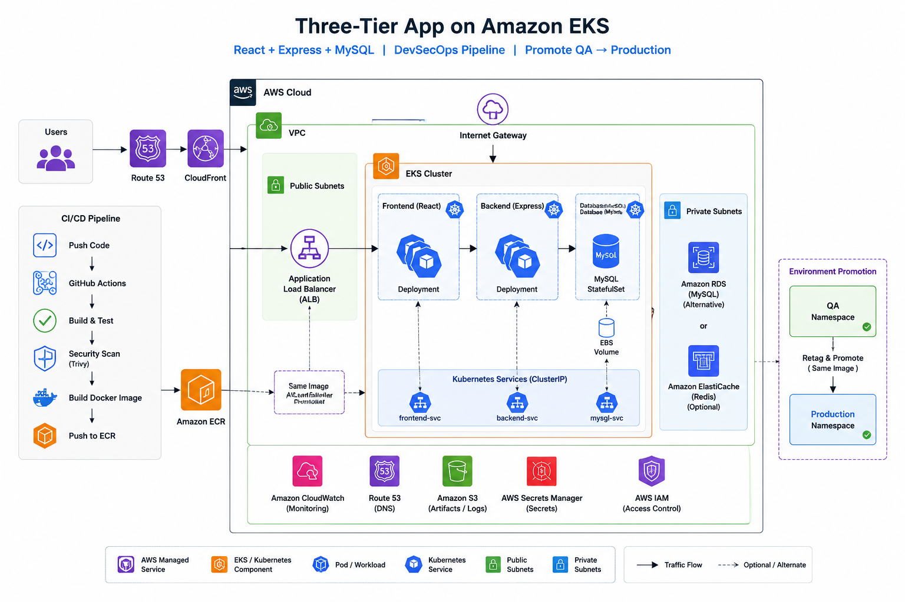

# Three-Tier App on EKS with a DevSecOps Pipeline

A React + Express + MySQL application deployed to AWS EKS through a
GitHub Actions pipeline, with environment promotion from QA to production.

## Architecture

Traffic reaches an ALB provisioned by the AWS Load Balancer Controller,
which routes to a ClusterIP service fronting the application pods. The
same image is promoted from QA to production rather than rebuilt, so
what ships is exactly what was tested.

## Tech stack

Node.js 20, React, MySQL, Docker, Kubernetes (EKS), GitHub Actions, Terraform.

## Repository structure

- `src/` application code, split into client and server
- `k8s/` Kubernetes manifests, split by environment
- `terraform/` cluster and networking infrastructure
- `docs/` architecture notes and diagrams

## Running locally

    cp .env.example .env
    docker compose up --build

The app is available at http://localhost:5000

## What I learned

Building the promotion flow taught me why rebuilding an image per
environment is a trap: the artifact that passed testing must be the
artifact that ships. Moving to a retag-and-promote model removed a
whole class of "works in QA" failures.
test
test
test